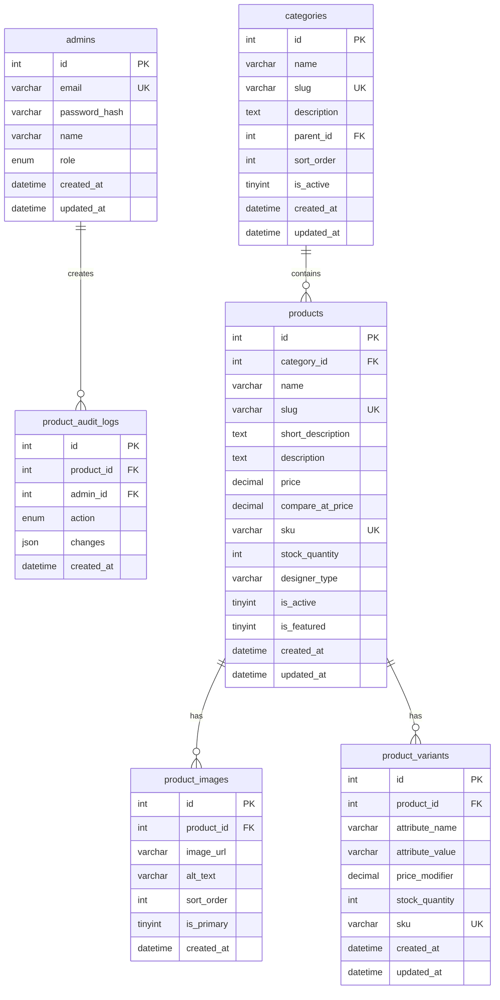

# ER-модель маркетплейсу Memory Moments

## Діаграма сутностей

## Опис сутностей

| Сутність | Призначення |
|----------|-------------|
| **admins** | Адміністратори з доступом до панелі керування |
| **categories** | Категорії товарів (ієрархічні через `parent_id`) |
| **products** | Картки товарів маркетплейсу |
| **product_images** | Галерея зображень товару |
| **product_variants** | Варіанти (колір, розмір) з окремим залишком |
| **product_audit_logs** | Журнал змін товарів адміністратором |

## Зв'язки

- `categories.parent_id` → `categories.id` (self-reference, nullable)
- `products.category_id` → `categories.id` (RESTRICT)
- `product_images.product_id` → `products.id` (CASCADE)
- `product_variants.product_id` → `products.id` (CASCADE)
- `product_audit_logs.product_id` → `products.id` (SET NULL)
- `product_audit_logs.admin_id` → `admins.id` (SET NULL)

## Поле `designer_type`

Зв'язує товар маркетплейсу з типом продукту в конструкторі (`crew-neck`, `mug`, `polaroid` тощо), щоб кнопка «Створити дизайн» відкривала потрібний шаблон.

## Індекси

- `products(is_active, is_featured)` — вітрина маркетплейсу
- `products(category_id)` — фільтр по категорії
- `product_images(product_id, is_primary)` — головне фото
- `categories(slug)` — SEO URL
