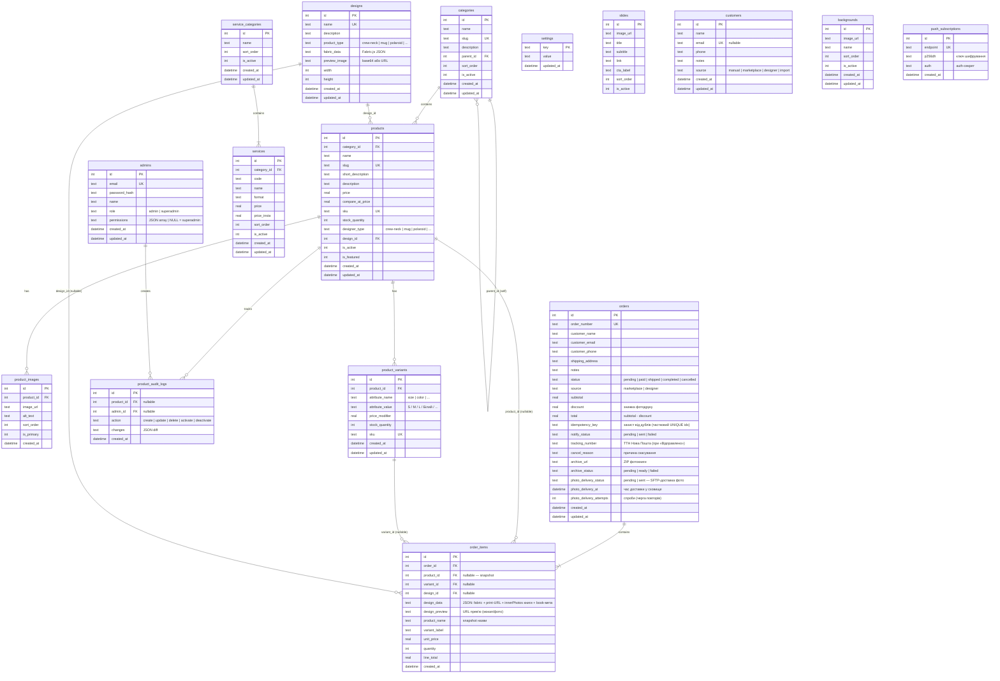

# ER-модель маркетплейсу Memory Moments

**База даних:** SQLite (dev, `marketplace/server/marketplace.db`) / **PostgreSQL** (prod, `DATABASE_URL`)  
**Шар:** `src/config/db.js` — єдиний `query()`/`transaction()` для обох рушіїв (джерело істини схеми).  
**Останнє оновлення:** 2026-06-20

> Схема + ідемпотентні міграції застосовуються автоматично на старті сервера
> (`ADD COLUMN IF NOT EXISTS` на Postgres, `PRAGMA table_info` + `ALTER TABLE` на SQLite),
> тож запуск проти наявної БД сам себе доліковує до актуальної схеми.
> Усі `created_at`/`updated_at` зберігаються в **UTC** (`CURRENT_TIMESTAMP`).

---

## Діаграма сутностей

---

## Опис сутностей

| Сутність | Призначення |
|----------|-------------|
| **admins** | Адміністратори панелі; `permissions` — JSON-масив дозволів (NULL = superadmin) |
| **categories** | Категорії товарів; `parent_id` — самопосилання для ієрархії |
| **products** | Товари каталогу; `designer_type` → прив'язка до типу в конструкторі |
| **designs** | Збережені дизайни з конструктора (Fabric.js JSON + PNG прев'ю) |
| **product_images** | Галерея зображень товару (кілька на товар, `is_primary`) |
| **product_variants** | Варіанти товару (розмір/колір) з власним `price_modifier` і залишком |
| **product_audit_logs** | Журнал змін товарів адміністраторами |
| **orders** | Замовлення клієнтів; `source` — з сайту або з конструктора. Життєвий цикл: `idempotency_key` (захист від дублів, частковий UNIQUE), `notify_status` (web-push власнику), `tracking_number` (ТТН Нова Пошта), `cancel_reason`, `archive_url`/`archive_status` (ZIP фотокниги), `photo_delivery_*` (SFTP-доставка фото у сховище) |
| **order_items** | Позиції замовлення; `product_name` — snapshot, щоб не залежати від змін |
| **service_categories** | Категорії прайс-листа |
| **services** | Послуги прайс-листа (`code`+`format`→ціна; коди звʼязані з конструктором) |
| **settings** | Key-value: лічильники номерів (`order_seq_*`), SMTP, налаштування сайту (`site_contacts`/`site_delivery`/`site_discounts`/`site_hero`/`site_seo`), Telegram (`telegram`), SFTP-сховище фото (`sftp_storage`), авто-згенеровані VAPID-ключі Web-Push (`push_vapid_public`/`push_vapid_private`). Дефолти конфігу — у коді |
| **slides** | Слайди банера маркетплейсу (адмін-керовані) |
| **backgrounds** | Готові фони для фотоальбомів (адмін-керовані: завантаження/сортування/активність) |
| **push_subscriptions** | Web-Push підписки власника (по одній на пристрій); `endpoint` UK, `p256dh`/`auth` — ключі шифрування |
| **customers** | CRM: автозахоплення клієнтів із замовлень (за email/телефоном) |

---

## Зв'язки та FK-поведінка

| FK | Посилання | ON DELETE |
|----|-----------|-----------|
| `categories.parent_id` | `categories.id` | SET NULL |
| `products.category_id` | `categories.id` | RESTRICT |
| `products.design_id` | `designs.id` | — (nullable, без FK constraint) |
| `product_images.product_id` | `products.id` | CASCADE |
| `product_variants.product_id` | `products.id` | CASCADE |
| `product_audit_logs.product_id` | `products.id` | SET NULL |
| `product_audit_logs.admin_id` | `admins.id` | SET NULL |
| `order_items.order_id` | `orders.id` | CASCADE |
| `order_items.product_id` | `products.id` | SET NULL |
| `services.category_id` | `service_categories.id` | CASCADE |

---

## Поле `designer_type`

Пов'язує товар маркетплейсу з типом продукту в конструкторі:

| Значення | Тип продукту |
|----------|-------------|
| `crew-neck` | Футболка (перёд/зад, 2D + 3D) |
| `mug`, `mug-*` | Чашки (5 видів) |
| `polaroid`, `instax-mini`, `photo-*` | Фотопродукція (полароїди, Instax, фото 10×15…А4, квадрат) |
| `canvas` | Полотно на підрамнику |
| `slim-book`, `print-book` | Фотокниги (обкладинка перёд/зад + фото розворотів/листів) |

Товари з `designer_type IS NOT NULL` **не відображаються** у каталозі та **не видаляються** через API.

---

## Snapshot-патерн у замовленнях

`order_items.product_name` і `unit_price` зберігаються як snapshot на момент замовлення. Навіть якщо товар буде перейменований або ціна зміниться, дані замовлення залишаються незмінними. `product_id` nullable — якщо товар видалено, позиція замовлення залишається з `product_id = NULL` але зберігає всі дані.
